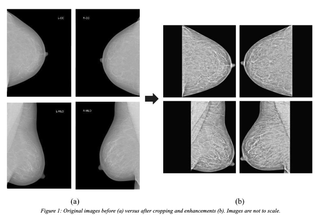
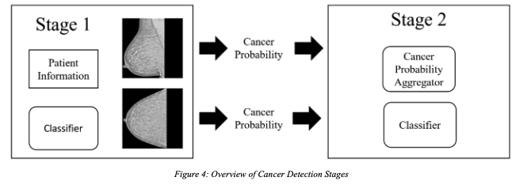
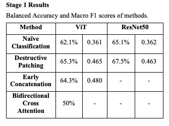
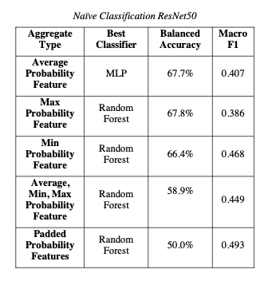
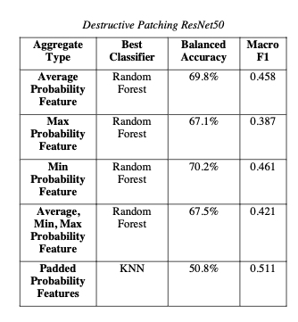
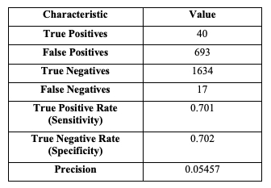

# RSNA Cancer Detection Paper

## About
**Term Project for Advanced Data Mining course (COMP 7944) at the University of Manitoba**

Developement Stack
- Python: 
    - ResNets
    - Vision Transformers
    - Image augmentation libraries
    - Scikit-learn (Classification)
- Google Cloud Platforms: 
    - Cloud GPU training and testing

## Links

- [Paper: Multiple Multi-Modal Methods of Malignant Mammogram Classification (M6C)](Report.pdf) 

- [RSNA Breast Cancer Dataset](https://www.kaggle.com/competitions/rsna-breast-cancer-detection/data)

## Abstract

- In  this  paper,  we propose  multiple  multimodal  classification  techniques  and use  them  to  detect  cancers  in  the  RSNA  Breast  Cancer Dataset. 

- We perform our own preprocessing and propose our own novel architectures to classify raw mammogram scan data.

## The Dataset

- The RSNA Screening Mammography Breast Cancer Detection Challenge dataset contains 54,706 DICOM (.dcm)scans across 11,913 patients as well as metadata about each patient and scan. 
- Of these scans, 1158 (approximately 2%) were identified as containing cancer, and these were distributed across 486 patients. 

1. Mammogram Scans:
    - The mammogram scans were captured using one of six different views (CC, MLO, ML, LM, AT, LMO), across ten different machines from two different sites. 
    - The dimensions of the scans are non-square and varied depending on the id of the machine which performed the scan. At full size, each scan is around 3000 pixels in each dimension.
    - Despite only containing 54k scans, each is very detailed, and the total dataset takes up just over 314GB. 

2. Tabular data
    - Tabular data includes  atient information and image metadata, such as the patient's age, whether a biopsy was performed, whether it was invasive, the BIRADS score, if there is an implant, density level, and whether the image is a difficult negative case. 

## Preprocessing
Our preprocessing and enhancements steps includes:
- Scale
- Crop
- Augmentation
- Oversampling minority class was required

## Our Solution

Our solution contains two key stages: (1) **determine the likelihood of cancer** of individual scans and (2) **aggregates the probability of all scans** to produce a prediction. Across both stages, we try multiple techniques for each to see what
performs best.

1. Stage 1 Techniques:
    - Method 1: Naïve Classification
    - Destructive Patching
    - Early Concatenation
    - Bidirectional Cross Attention

2. Stage 2 Techniques
    - Average Probability Feature
    - Max Probability Feature
    - Min Probability Feature
    - Average, Min, Max Probability Features
    - Padded Probability Features

## Findings and Results

### 1. Image Classification

- ResNet50 outperformed the ViT across all our techniques.
    - Potentially due to the benefit of using ViTs come from long training sessions and extensive pretraining, with which we were heavily constrained.
- Multi-modal techniques allowed for greater classification accuracy on single images
    - Destructive Patching being our most successful technique, giving +3.1% accuracy on ViTs and +2.4% accuracy on the ResNet50 when compared to Naïve Classification

### 2. Probability Aggregation and Prediction

- The classifier which was nearly consistently the best to use and the fastest to train was the Random Forest Classifier. 
- Across all Stage 1 techniques, the best aggregate type to use was consistently either the 
Max or Min Probability Feature. While there were concerns that these methods would oversimplify breast scans, they performed significantly better than methods which returned  more information such as Average, Min, Max Probability and Padded Probability Features

### 3. Solution Overall

- Overall, ViT based approaches were able to increase their accuracy to 66.7%, and Resnet50 based approaches achieved the highest accuracy across all methods at 70.2% 
accuracy.

- The best performing technique, ResNet50 with Destructive Patching and Minimum Probability Aggregation had the following characteristics of its predictions on the test set:  

## Limitations and Future Work

- Constraints on time and computational resources. Large and powerful models like ViTs benefit from having long training times on very large amounts of data. We had to train for fewer epochs and perform less exhaustive grid searches than preferable. 
- Trying our multimodal methods on a large, standardized dataset such as the NYU Breast Cancer Screening Dataset would yield more informative results which could be compared to state-of-the-art techniques. 

## Credit and Acknowledgement

Team Members:
- Jase Tran
- Christopher Vattheuer

Project Supervisor and Course Instructor: 
- Dr. Carson K. Leung
